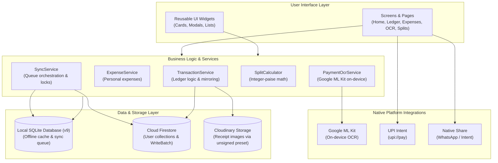
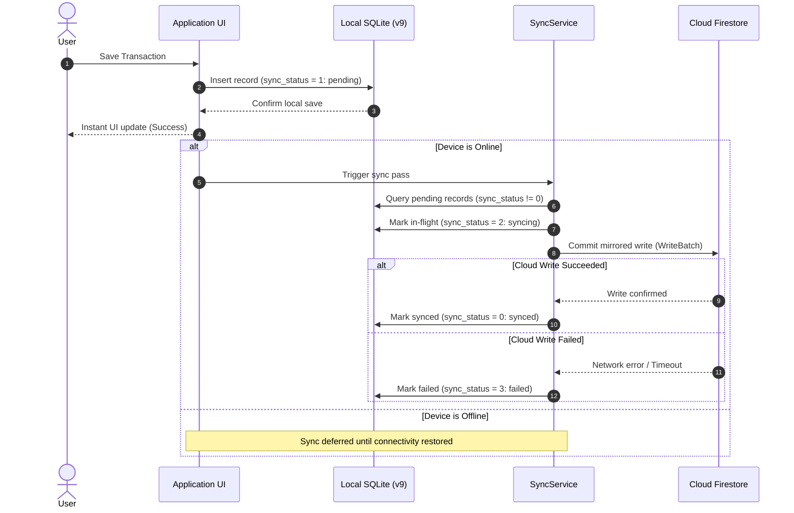

# Hisab Karle

A personal money and transaction management application combining bilateral person-to-person give/take tracking with daily personal expenditure management.

---

## Overview

People typically manage three distinct financial workflows in everyday life:
1. **Money given to others** (loans, advances, bill shares to collect).
2. **Money taken from others** (borrowed funds, split shares to repay).
3. **Personal daily expenses** (groceries, food, transport, bills).

Conventional expense trackers force all three workflows into generic expense categories. This distorts personal consumption figures and makes reconciling debts with friends confusing.

**Hisab Karle** bridges this gap by unifying a dedicated **Person-to-Person Ledger** and a **Personal Expenditure Ledger** into a single, offline-first mobile application.

---

## Why Hisab Karle?

- **Dual-Ledger Separation:** Keeps individual consumption separate from bilateral peer debts so neither figure is misrepresented.
- **Directional Balances:** Automatically computes net outstanding balances (`totalGiven - totalTaken`) per contact.
- **On-Device Receipt OCR:** Parses payment screenshots locally to extract transaction details without manual data entry.
- **Peer Mirroring:** Bilateral cloud entries reflect the same transaction from both parties' perspectives.
- **Offline-First Resilience:** Instant local persistence to SQLite ensures transactions can be recorded anywhere, synchronizing with Cloud Firestore when connectivity is available.

---

## Core Features

### Person-to-Person Money Tracking
- **Directional Transactions:** Record transactions as **You Gave** (money lent/paid for friend) or **You Took** (money borrowed/received from friend).
- **Net Balance Calculation:** Real-time net balance per contact showing whether you need to collect or pay, plus an overall ledger balance.
- **Individual Person Ledgers:** Dedicated chronological transaction histories with dates, notes, and receipt attachments.
- **Settlement Lifecycle:** Record partial or full debt settlements, bringing balances back to zero.
- **Soft Deletion & Restoration:** Deleted entries move to an archival ledger (`deleted_entries`), preserving original metadata, timestamps, and receipt proofs with full restoration capability.

### Daily Personal Expenses
- **Categorized Spending:** Track personal expenses across categories (Food, Travel, Bills, Shopping, Entertainment, Health, Grocery, Other).
- **Isolated Accounting:** Personal spending is kept separate from person-to-person debts so personal budgets are not skewed by shared expenses.
- **Date Filtering & Summaries:** Review spending trends across custom date ranges and monthly views.

### Payment Screenshot OCR
- **On-Device Text Recognition:** Uses Google ML Kit on-device text recognition with both Latin and Devanagari script models.
- **Verified Extraction Capabilities:**
  - Transaction amounts (supporting standard decimals, Indian comma notation, and standalone numbers).
  - UPI transaction IDs and UTR reference numbers (e.g., 12-digit references).
  - Transaction timestamps and dates.
  - Receiver name detection and confidence-based contact matching.
  - Devanagari numeral normalization (`०-९` $\rightarrow$ `0-9`).
- **Real-World Regression Testing:** Tested against payment confirmation screenshots from Indian payment applications, including PhonePe, Google Pay, Navi, and Slice.
- **Privacy-Preserving:** OCR text recognition is executed 100% on the device. Raw image data is not sent to external third-party OCR services.

### Peer-to-Peer Transaction Mirroring
- **Bilateral Accounting:** When User A records giving ₹500 to User B, Cloud Firestore `WriteBatch` automatically creates a corresponding mirrored transaction in User B's account:
  - User A's record: Given ₹500 to User B (`iGave: true`).
  - User B's mirrored record: Received ₹500 from User A (`iGave: false`).
- Both records share the same deterministic identifier.
- *Note:* Hisab Karle is a transaction recording and ledger application. It records and tracks bilateral debts; it does not process or execute banking transfers.

### Offline-First Synchronization
- **Immediate Local Persistence:** New records and edits write directly to SQLite, providing instant UI feedback without waiting for network responses.
- **Sync State Machine:**
  - `0 = synced`: Successfully committed to Cloud Firestore.
  - `1 = pending`: Stored in local SQLite, queued for synchronization.
  - `2 = syncing`: In-flight synchronization pass.
  - `3 = failed`: Synchronization failed (network drop or server error); safely preserved for automatic retry.
- **Automated Sync Triggers:** Background sync is orchestrated by `SyncService`, triggered on app launch, post-write, user authentication, and network reconnect via `connectivity_plus`.
- **Deterministic Document IDs:** Retries reuse deterministic Firebase document IDs generated at creation time to prevent duplicate records in Firestore.
- **Concurrency Guard:** An internal mutex lock (`isSyncing`) prevents duplicate simultaneous sync passes.

### Receipt Management
- **Durable Local Storage:** Captured receipts are compressed client-side and saved to a persistent application storage directory on the device (`receiptPath`).
- **Deferred Cloud Upload:** Receipts upload to Cloudinary in the background, updating the transaction with a remote `receiptUrl` once complete.
- **Failure Resilience:** If a network upload fails, the local file is preserved on-device and queued for retry without data loss.
- *Note:* Cloudinary uploads use an unsigned client upload preset. Uploaded URLs are hosted on public content delivery infrastructure and do not feature private per-user access authorization.

### Split Calculator
- **Equal & Percentage Splits:** Calculate shared expenses equally or by customized percentage shares across groups.
- **Integer-Paise Precision:** Calculations operate on integer paise (`paise = (amount * 100).round()`) rather than raw floating-point numbers.
- **Remainder Reconciliation:** Remainder paise are distributed deterministically to the first participants, ensuring the sum of split shares always equals the total amount without penny drift.

### UPI Integration
- **Deep-Link Payment Initiation:** Generates and launches standard `upi://pay` deep links to open installed UPI payment applications (e.g., Google Pay, PhonePe, Paytm, BHIM) with pre-filled payee details and amounts.
- *Note:* Hisab Karle initiates native platform deep-links to external UPI apps; it does not act as an internal UPI payment processor.

### WhatsApp Integration
- **Statement & Receipt Sharing:** Formats structured, human-readable debt summaries and statements for one-tap sharing through WhatsApp and native Android share sheets.

### Additional Features
- **Firebase Authentication:** Secure account authentication with Google Sign-In.
- **Contact Management:** Manage contacts, friend profiles, and custom local nicknames.
- **In-App Update Check:** Queries remote app configuration to notify users when newer application builds are available.

---

## Technical Architecture



### Architectural Highlights
- **Decomposed Architecture:** Clear boundaries between presentation screens, domain business logic services, data models, and database access helpers.
- **Two-Tier Data Flow:** All operations target SQLite first for immediate local persistence and responsive user interaction, with `SyncService` asynchronously reconciling local state with Cloud Firestore.
- **Atomic Operations:** Mirrored cloud writes utilize Firestore `WriteBatch` to ensure bilateral transactions either commit together or fail safely without partial state.

---

## Offline-First Data Flow



---

## Local Database Schema (v9)

Hisab Karle uses **SQLite** (schema version 9) for local data persistence.

```
+---------------------------------------------------------------------------------+
|                                  transactions                                   |
+---------------------------------------------------------------------------------+
| id            | INTEGER PRIMARY KEY AUTOINCREMENT                               |
| firebaseId    | TEXT (Deterministic Cloud Firestore Document ID)                |
| createdBy     | TEXT (Owner Firebase UID)                                       |
| peerUserId    | TEXT (Peer Firebase UID for bilateral mirroring)                |
| friendName    | TEXT (Contact display name)                                     |
| amount        | REAL (Transaction amount)                                       |
| note          | TEXT (Description / purpose)                                    |
| date          | TEXT (ISO-8601 or YYYY-MM-DD date string)                       |
| iGave         | INTEGER (1 = You Gave / Credit, 0 = You Took / Debit)           |
| receiptPath   | TEXT (Local on-device receipt file path)                        |
| receiptUrl    | TEXT (Cloudinary remote image URL)                              |
| sync_status   | INTEGER (0 = synced, 1 = pending, 2 = syncing, 3 = failed)      |
+---------------------------------------------------------------------------------+

+---------------------------------------------------------------------------------+
|                                personal_expenses                                |
+---------------------------------------------------------------------------------+
| id            | TEXT PRIMARY KEY (UUID / local identifier)                      |
| userId        | TEXT (Owner Firebase UID)                                       |
| amount        | REAL (Expense amount)                                           |
| category      | TEXT (e.g., Food, Travel, Bills, Shopping, Health, Other)        |
| description   | TEXT (Note / merchant name)                                     |
| expenseDate   | TEXT (ISO-8601 timestamp)                                       |
| receiptUrl    | TEXT (Cloudinary remote image URL)                              |
| createdAt     | TEXT (ISO-8601 timestamp)                                       |
| sync_status   | INTEGER (0 = synced, 1 = pending, 2 = syncing, 3 = failed)      |
+---------------------------------------------------------------------------------+

+---------------------------------------------------------------------------------+
|                                 deleted_entries                                 |
+---------------------------------------------------------------------------------+
| id              | INTEGER PRIMARY KEY AUTOINCREMENT                             |
| originalEntryId | INTEGER (Original transaction ID in local table)              |
| personId        | INTEGER (Deterministic contact hash)                          |
| userId          | TEXT (Owner Firebase UID)                                     |
| friendName      | TEXT (Contact display name)                                   |
| date            | TEXT (Transaction date)                                       |
| note            | TEXT (Description)                                            |
| amount          | REAL (Transaction amount)                                     |
| isGiven         | INTEGER (1 = You Gave, 0 = You Took)                          |
| clearedDate     | TEXT (Timestamp when record was cleared / deleted)            |
| receiptPath     | TEXT (Preserved local receipt path)                           |
| receiptUrl      | TEXT (Preserved Cloudinary receipt URL)                       |
+---------------------------------------------------------------------------------+

+---------------------------------------------------------------------------------+
|                    cached_friends & friend_nicknames                            |
+---------------------------------------------------------------------------------+
| cached_friends   | friendUid (PK), friendName, email, friendCode, cachedAt      |
| friend_nicknames | friendName (PK), nickname                                    |
+---------------------------------------------------------------------------------+

+---------------------------------------------------------------------------------+
|                         settings & migration_meta                               |
+---------------------------------------------------------------------------------+
| settings         | id (PK), bankBalance                                         |
| migration_meta   | key (PK), value                                              |
+---------------------------------------------------------------------------------+
```

---

## Technology Stack

| Area | Technology | Implementation Details |
| :--- | :--- | :--- |
| **Framework** | Flutter | Cross-platform mobile framework targeting Android |
| **Language** | Dart | Strong-mode Dart (SDK ^3.12.0) |
| **Authentication** | Firebase Auth + Google Sign-In | User identity and account sessions (`firebase_auth`, `google_sign_in`) |
| **Cloud Database** | Cloud Firestore | Bilateral mirrored transactions with `WriteBatch` (`cloud_firestore`) |
| **Local Database** | SQLite (`sqflite`) | Local persistence, v9 migration, offline caching |
| **Offline Sync** | Custom `SyncService` | State machine queue with `connectivity_plus` network listeners |
| **On-Device Vision**| Google ML Kit | Latin and Devanagari OCR models (`google_mlkit_text_recognition`) |
| **Media Storage** | Cloudinary | Unsigned image preset client uploads via HTTP multipart |
| **Local Media** | `flutter_image_compress` | Client-side compression and local image caching |
| **Native Intents** | `url_launcher` & `share_plus` | UPI payment initiation (`upi://pay`) and WhatsApp statement sharing |
| **Testing** | Flutter Test & `sqflite_common_ffi` | Headless unit and regression testing suite |
| **Static Analysis**| Dart Analyzer (`flutter_lints`) | 0 issues across strict lint rules |
| **Secret Scanner** | Custom Dart Scanner | `tool/check_secrets.dart` static analysis of codebase |

---

## Security & Data Integrity

- **Multi-User Isolation on SQLite:** All local transaction, expense, and deleted entry queries strictly enforce ownership clauses (`createdBy = ? OR peerUserId = ?`). Switching accounts on the same device isolates data between users.
- **Firebase Client Configuration:** The keys present in `firebase_options.dart` (`apiKey`, `appId`, `projectId`) are client-side public identifiers required to route mobile traffic to the Firebase project. They are not administrative service-account secrets. Access security is enforced on the cloud via Firebase Authentication and backend rules.
- **Cloudinary Client Preset:** Image uploads utilize an unsigned client upload preset (`receipt_upload`). No Cloudinary API secret is embedded in the application. Uploaded images are hosted on Cloudinary's public CDN; users should not attach sensitive personal identification documents.
- **Idempotency & Deduplication:** Transactions generate deterministic document IDs at creation. Network retries update existing records rather than creating duplicates.
- **Re-Entrancy & Double-Tap Guards:** Save and sync buttons feature async execution locks and state debouncing to prevent duplicate records from rapid taps.
- **UI State Safety:** Asynchronous background callbacks verify Flutter `mounted` state before calling `setState()` to avoid memory leaks and unmounted tree exceptions.

---

## Testing & Quality Engineering

Hisab Karle maintains an automated test suite executed via `flutter test` and `sqflite_common_ffi`:

```
============================================================
TEST SUITE SUMMARY
============================================================
Total Automated Tests:   114
Total Test Files:        10
Passing:                 114
Failing:                 0
Analyzer Issues:         0 (flutter analyze clean)
Secret Scanner Status:   0 exposed secrets (tool/check_secrets.dart clean)
Measured Line Coverage:  ~41.6% overall executable line coverage
                         - 100.0% transaction_model.dart
                         -  87.5% split_calculator.dart
                         -  85.7% friend_model.dart
                         -  84.2% receiver_matcher.dart
                         -  83.5% payment_ocr_service.dart
                         -  69.0% amount_parser.dart
                         -  48.3% expense_model.dart
============================================================
```

### Test Suite Breakdown
1. **[test/payment_ocr_test.dart](test/payment_ocr_test.dart) (23 tests):** Regression test suite covering real payment screenshots (PhonePe, GPay, Navi, Slice), amount parser, Devanagari normalization, and deterministic date extraction.
2. **[test/offline_sync_test.dart](test/offline_sync_test.dart) (19 tests):** Sync queue state machine, v8 to v9 migration, interrupted sync recovery, and retry idempotency.
3. **[test/transaction_business_logic_test.dart](test/transaction_business_logic_test.dart) (14 tests):** Directional balance math, multi-transaction aggregation, soft deletion, restoration, and peer mirroring logic.
4. **[test/split_calculator_test.dart](test/split_calculator_test.dart) (13 tests):** 7-way splits, micro-amounts (1 paisa, 5 paise), decimal splits, and custom validation boundaries.
5. **[test/financial_input_validation_test.dart](test/financial_input_validation_test.dart) (12 tests):** Boundary testing rejecting zero, negative, NaN, infinity, and excessive amounts (> ₹10 crore).
6. **[test/settlement_test.dart](test/settlement_test.dart) (9 tests):** Full, partial, zero-balance, over-settlement, sequential settlement, and settlement history logging.
7. **[test/daily_expense_test.dart](test/daily_expense_test.dart) (8 tests):** Expense CRUD, category preservation, date range queries, and user ownership isolation.
8. **[test/multi_user_isolation_and_auth_test.dart](test/multi_user_isolation_and_auth_test.dart) (7 tests):** User scoping, cross-account query boundaries, and login/logout transitions.
9. **[test/receipt_lifecycle_and_errors_test.dart](test/receipt_lifecycle_and_errors_test.dart) (7 tests):** Local receipt persistence, upload failure retention, corrupted OCR safety, and crash recovery.
10. **[test/database_migration_test.dart](test/database_migration_test.dart) (2 tests):** Safe v8 to v9 schema migration verifying column additions without data loss.

### Running Verification Locally

```bash
# Run all automated tests
flutter test

# Run static code analysis
flutter analyze

# Run repository secret scanner
dart run tool/check_secrets.dart --all
```

### Current Testing Scope & Known Gaps
- **Live Cloudinary Multipart Upload:** Unit tests mock remote network responses and verify local filesystem persistence; live Cloudinary uploads are tested manually.
- **Live Firestore Batch Commits:** Verified via headless SQLite schemas and unit tests; end-to-end multi-device cloud testing requires active Firebase connectivity.
- **Flutter UI Widget Tests:** Current automated coverage focuses on business logic, calculations, database migrations, and sync state machines. Full `WidgetTester` UI integration tests are planned for future testing passes.

---

## Project Structure

```text
hisab_kitab/
├── assets/
│   └── images/              # Application logo and graphic assets
├── lib/
│   ├── core/
│   │   ├── constants/       # Global app constants, Cloudinary and Firebase keys
│   │   ├── storage/         # Local receipt compression and storage utilities
│   │   └── utils/           # Shared display and perspective formatters
│   ├── database/
│   │   └── database_helper.dart # SQLite database helper, migrations, and CRUD
│   ├── models/
│   │   ├── expense_model.dart     # Personal expense data model
│   │   ├── extracted_payment_info.dart # OCR extraction result model
│   │   ├── friend_model.dart      # Contact and friend profile models
│   │   └── transaction_model.dart # Transaction and soft-deleted entry models
│   ├── screens/
│   │   ├── auth/            # Sign-in and authentication screens
│   │   ├── friends/         # Contact management and profile screens
│   │   ├── home/            # Home dashboard and summary overview
│   │   ├── settlements/     # Settlement history screens
│   │   └── transactions/    # Add/edit transaction, detail, and deleted screens
│   ├── services/
│   │   ├── expense_service.dart     # Cloud expense synchronization
│   │   ├── payment_ocr_service.dart # On-device Google ML Kit OCR engine
│   │   ├── split_calculator.dart    # Integer-paise bill splitting logic
│   │   ├── sync_service.dart        # Background offline-first sync engine
│   │   └── transaction_service.dart # Firestore transactions and peer mirroring
│   ├── theme/
│   │   └── app_theme.dart   # Light and dark design themes and color palettes
│   ├── utils/
│   │   └── amount_parser.dart # Centralized Indian currency and amount parser
│   ├── firebase_options.dart # Firebase configuration for Android
│   └── main.dart            # Application bootstrap, routing, and lifecycle
├── test/                    # 10 test files with 114 automated unit tests
└── tool/
    └── check_secrets.dart   # Repository secret scanner
```

---

## Getting Started

### Prerequisites
- **Flutter SDK:** Compatible with Dart `^3.12.0` (Flutter 3.x)
- **Android Studio** with Android SDK (API Level 21 or higher)
- A physical Android device or Android emulator with Google Play Services (required for Google Sign-In and ML Kit)

### Setup Instructions

1. **Clone the repository:**
   ```bash
   git clone https://github.com/harichan18/Hisab-Kitab.git
   cd Hisab-Kitab
   ```

2. **Install dependencies:**
   ```bash
   flutter pub get
   ```

3. **Configure Firebase (Android):**
   - Create a project in the [Firebase Console](https://console.firebase.google.com/).
   - Add an Android application using your package identifier (e.g., `com.example.hisab_kitab`).
   - Download `google-services.json` and place it at:
     ```
     android/app/google-services.json
     ```
   - Enable **Authentication** (Google Sign-In) and **Cloud Firestore** in your Firebase project.

4. **Run on Android:**
   ```bash
   flutter devices
   flutter run
   ```

*Note: Web and desktop platforms are not configured out-of-the-box (`DefaultFirebaseOptions` targets Android).*

---

## Current Platform Support

- **Android:** Primary supported and tested target platform.
- **iOS / Web / Desktop:** Not configured out-of-the-box. Running on Chrome (`flutter run -d chrome`) is not supported without additional platform-specific Firebase and plugin configuration.

---

## Roadmap

Planned future enhancements:
- [ ] Automated SMS transaction parsing for Indian banking alerts.
- [ ] Export transactions and expenses to CSV / Excel.
- [ ] Periodic scheduled cloud backups.
- [ ] Expanded Flutter widget and UI integration test coverage.
- [ ] Granular access and privacy controls for shared payment receipts.
- [ ] Cross-platform configuration for iOS.

---

## Screenshots

> Real device UI screenshots and visual walkthroughs will be added here in an upcoming release.

Recommended showcase screens:
1. **Home / Dashboard:** Net directional balances and recent activity overview.
2. **Person Ledger:** Individual bilateral transaction histories and status chips.
3. **Add Transaction / Payment OCR:** On-device camera/gallery screenshot parsing.
4. **Settlement Flow:** Full and partial debt clearing with reconciliation.
5. **Daily Expenses:** Categorized personal expenditure tracking.
6. **Split Calculator:** Integer-paise equal and percentage split breakdown.
7. **Reports & Analytics:** Spending category distributions and period summaries.
8. **Offline Sync Status:** Visual indicators for local pending and synced states.

---

## Developer

**Harichan Kushwaha**  
Information Technology  
Vishwakarma Institute of Technology, Pune
